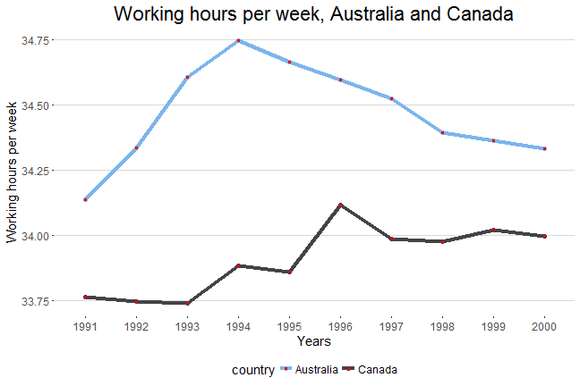

## Project Description

* The main goal of this project was to create Shiny application and provide a reproducible pitch for it in a form of Slidify presentation.  

* I have decided to use open data from [gapminder] (https://www.gapminder.org/data/), specifically [working hours per week data set] (https://docs.google.com/spreadsheets/d/1WPjCgWnDnRY_3wdW9_5KuIDHS-Lz1fML8Dcn0QNGiSs/pub) provided by International Labor organization.  

* The idea behind the app is to compare two countries by working hours per week during a specific time period.  

* The app itself is available [here] (https://andrey-budish.shinyapps.io/workinghours/)  

* All source files, Shiny app related code and this presentation, are available at [https://github.com/abudish/workingHours] (https://github.com/abudish/workingHours)

---

## The Working Hours per Week App
* This app allows you to see how working hours per week has changed for one country and compare it to another country for the same time period

* To use the app one should choose two countries from available listboxes.  

* Then choose a range of years (available range is 1985-2007)

* The results are displayed in 3 tabs:
  > 1. Tab 'Plot': displayes time series plot for the selected countries and period
  > 2. Tab 'Selected data': selected data in a form of a data table with variables country, year and hours_per_week
  > 3. Tab 't-Test': shows  the result of Welch Two Sample t-test that checks if there is a difference between hours_per_week variable for the selected countries and period.

---

## Data set
Original data set is not 'tidy', so it needs to be transformed in the way that each row is a unique observation. Transformed data set contains 3 variables: country, year and hour_per_week. Total number of unique countries is 25, year range is from 1985 to 2007, number of observations is 575.


```r
library(reshape2); library(readxl)
df <- read_xlsx("Working hours per week (1985 - 2007).xlsx")
df <- melt(df, id="Working hours per week")
colnames(df) <- c("country", "year", "hours_per_week")
head(df, 3)
```

```
##     country year hours_per_week
## 1 Australia 1985       34.33846
## 2   Austria 1985             NA
## 3   Belgium 1985       34.59615
```

---

## Plot example
Below are the output plot, if user's input was: range - from 1991 to 2000, countries - Australia and Canada. 




